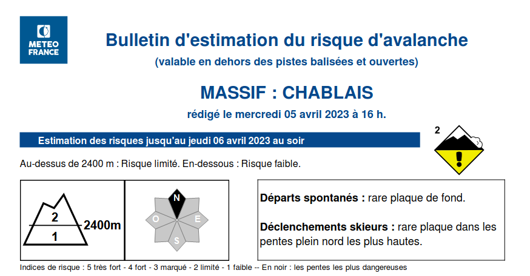
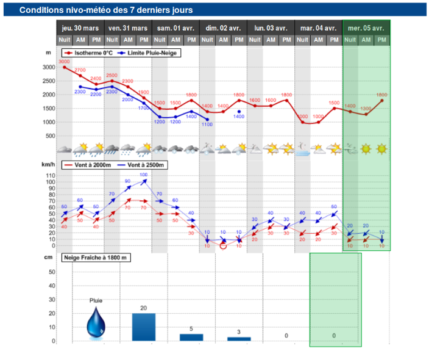

# General

Ce projet ouvre les données de Météo-France sur les Bulletins d'estimation du risque d'avalanche (BERA).
Ces données sont déjà [disponibles](https://donneespubliques.meteofrance.fr/?fond=produit&id_produit=265&id_rubrique=50), 
mais uniquement au format pdf et difficiles à traiter pour des réutilisations.

Les données extraites des BERAs sont enregistrées et disponibles dans les fichiers `data/<MASSIF>/hist.csv` de ce projet.

À ce jour les données extraites des BERAs renseignées dans les fichiers `data/<MASSIF>/hist.csv` reprennent par massif 
et jour de publication du BERA :
  - le niveau de risque et son évolution en fonction de l'altitude ou éventuellement au cours de la journée
  - l'url de téléchargement du BERA au format pdf
  - les données météo enregistrées et mesurées le jour de la publication du BERA
  - la hauteur de neige fraiche mesurée la veille du jour de la publication du BERA

Objectifs de réutilisations :
  - Evaluation du risque de la partie supérieure du manteau neigeux (préparation sorties)
  - Outil pédagogique afin d'étudier les accidents ayant eu lieu

# Autres projets
- [MetaSkiRando :](https://www.metaskirando.ovh/Nivo.php) Moteur de recherche du ski de rando (et [code source](https://github.com/c2corg/metaskirando))
- [Data Avalanche :](http://www.data-avalanche.org) Recensement des avalanches
- [Synthesis :](http://www.data-avalanche.org/synthesis/) Centrale de données nivologiques
- [Anena :](https://www.anena.org/)  Association Nationale pour l’Étude de la Neige et des Avalanches
- [YETI par CampToCamp](https://www.camptocamp.org/yeti) Préparation de sorties avec méthode de réduction des risques
- [Snowmap](https://snowmap.fr/)  Outil de visualisation cartographique de l'enneigement par massif
- [Aineva : bulletins d'estimation des risques d'avalanahc en Italie](https://bollettini-fr.aineva.it/bulletin/latest) Visualisation des risques d'avalanches sur les massifs montagneux italiens

# Modèle de données
Source :
  [Météo-France](https://donneespubliques.meteofrance.fr/?fond=produit&id_produit=265&id_rubrique=50)
  
Clé Primaire :
- date
- massif

|Nom|Titre|Type|Description|Exemple|Propriétés|
|-|-|-|-|-|-|
|date|Date d'émission du bulletin|string|Date d'émission. Le bulletin est valable pour le jour suivant. En général, les bulletins sont émis vers 16H|2023-04-05|Valeur obligatoire|
|massif|Massif|string|Massif concerné par l'estimation. La liste des massifs est connue. Le champ doit faire parti de cette liste|CHABLAIS|Valeur obligatoire|
|risque1|Risque 1|int|Niveau de risque estimé pour le massif à toutes les altitudes ou éventuellement pour les altitudes les plus basses (précisé par le champ altitude). Le risque peut pendre une valeur de 0 à 5. Plus la valeur est importante, plus le risque est important. Une valeur à -1 indique que le risque n'a pas pu être évalué. |2|Valeur obligatoire|
|evolurisque1| Evolution Risque 1|string|Evolution du risque au cours de la journée pour toutes les altitudes ou éventuellement pour les altitudes les plus basses (précisé par le champ altitude)||Valeur optionnelle|
|loc1|Localisation 1|int|Altitudes pour lesquelles le niveau de risque identifié par le champs risque1 pour le champs risque1 est observé|<2400|Valeur optionnelle|
|altitude|Altitude|string|Altitude à partir de laquelle le niveau de risque évolue (du niveau de risque identifié par le champs risque1 au niveau de risque identifié par le champs risque2)|2400|Valeur optionnelle|
|risque2|Risque 2|int|Niveau de risque estimé pour le massif pour les altitudes les plus hautes (précisé par le champ altitude). Le risque peut pendre une valeur de 0 à 5. Plus la valeur est importante, plus le risque est important. Une valeur à -1 indique que le risque n'a pas pu être évalué.|2|Valeur optionnelle (sauf si le champ altitude n'est pas vide)|
|evolurisque2|Evolution Risque 2|int|Evolution du risque au cours de la journée pour les altitudes les plus hautes||Valeur optionnelle|
|loc2|Localisation 2|string|Altitude à laquelle nous passons du risque 1 au risque 2|>2400|Valeur optionnelle (sauf si le champ altitude n'est pas vide)|
|risque_maxi|Risque Maximum|string|Risque estimé maximum pour le massif| 2 | Valeur obligatoire|
|commentaire|Commentaire|string|Commentaire fourni par météo france (déclenchements spontanés, déclenchements par skieur)| Au-dessus de 2400m : Risque faible évoluant en Risque limité. En dessous : Risque faible | Valeur optionnelle|
|url_telechargement|Url de téléchargement|string|Url de téléchargement du BERA en pdf|https://donneespubliques.meteofrance.fr/donnees_libres/Pdf/BRA/BRA.ANDORRE.20230327133137.pdf|Valeur optionnelle|
|00_temps|Météo à minuit|string|Météo (temps) enregistrée le jour de la publication du BERA à 00h00|Peu nuageux|Valeur optionnelle|
|00_mer_de_nuages|Présence d'une mer de nuages à minuit|string ("Oui" ou "Non")|Présence d'une mer de nuages enregistrée le jour de la publication du BERA à 00h00|Non|Valeur optionnelle|
|00_limite_pluie_neige|Altitude de la limite pluie-neige à minuit|string|Altitude (en mètre) de la limite pluie-neige mesurée le jour de la publication du BERA à 00h00|Sans objet|Valeur optionnelle|
|00_isotherme_0|Isotherme 0°C à minuit|string|Isotherme 0°C (en mètre) mesuré le jour de la publication du BERA à 00h00|1400|Valeur optionnelle|
|00_isotherme_moins_10|Isotherme -10°C à minuit|string|Isotherme -10°C (en mètre) mesuré le jour de la publication du BERA à 00h00|3000|Valeur optionnelle|
|00_altitude_vent_1|Altitude du premier point de mesure de vent à minuit|string|Altitude (en mètre) utilisée pour le premier point de mesure le plus bas du vent le jour de la publication du BERA à 00h00|2000|Valeur optionnelle|
|00_altitude_vent_2|Altitude de l'éventuel deuxième point haut de mesure de vent à minuit|string|Altitude (en mètre) utilisée pour l'éventuel deuxième point de mesure le plus haut du vent le jour de la publication du BERA à 00h00|2500|Valeur optionnelle|
|00_direction_vent_altitude_1|Direction du vent au point bas à minuit|string|Direction du vent mesurée au point de mesure bas le jour de la publication du BERA à 00h00|NE|Valeur optionnelle|
|00_vitesse_vent_altitude_1|Vitesse du vent au point bas à minuit|string|Vitesse du vent (en km/h) mesurée au point de mesure bas le jour de la publication du BERA à 00h00|10|Valeur optionnelle|
|00_direction_vent_altitude_2|Direction du vent au point haut à minuit|string|Direction du vent mesurée au point de mesure haut le jour de la publication du BERA à 00h00|NE|Valeur optionnelle|
|00_vitesse_vent_altitude_2|Vitesse du vent au point haut à minuit|string|Vitesse du vent (en km/h) mesurée au point de mesure haut le jour de la publication du BERA à 00h00|20|Valeur optionnelle|
|06_temps|Météo à 6h|string|Météo (temps) enregistrée le jour de la publication du BERA à 06h00|Beau temps|Valeur optionnelle|
|06_mer_de_nuages|Présence d'une mer de nuages à 6h|string ("Oui" ou "Non")|Présence d'une mer de nuages enregistrée le jour de la publication du BERA à 06h00|Non|Valeur optionnelle|
|06_limite_pluie_neige|Altitude de la limite pluie-neige à 6h|string|Altitude (en mètre) de la limite pluie-neige mesurée le jour de la publication du BERA à 06h00|Sans objet|Valeur optionnelle|
|06_isotherme_0|Isotherme 0°C à 6h|string|Isotherme 0°C (en mètre) mesuré le jour de la publication du BERA à 06h00|1300|Valeur optionnelle|
|06_isotherme_moins_10|Isotherme -10°C à 6h|string|Isotherme -10°C (en mètre) mesuré le jour de la publication du BERA à 06h00|2900|Valeur optionnelle|
|06_altitude_vent_1|Altitude du point bas de mesure de vent à 6h|string|Altitude (en mètre) utilisée pour le point de mesure le plus bas du vent le jour de la publication du BERA à 06h00|2000|Valeur optionnelle|
|06_altitude_vent_2|Altitude du point haut de mesure de vent à 6h|string|Altitude (en mètre) utilisée pour le point de mesure le plus haut du vent le jour de la publication du BERA à 06h00|2500|Valeur optionnelle|
|06_direction_vent_altitude_1|Direction du vent au point bas à 6h|string|Direction du vent mesurée au point de mesure bas le jour de la publication du BERA à 06h00|NE|Valeur optionnelle|
|06_vitesse_vent_altitude_1|Vitesse du vent au point bas à 6h|string|Vitesse du vent (en km/h) mesurée au point de mesure bas le jour de la publication du BERA à 06h00|10|Valeur optionnelle|
|06_direction_vent_altitude_2|Direction du vent au point haut à 6h|string|Direction du vent mesurée au point de mesure haut le jour de la publication du BERA à 06h00|NE|Valeur optionnelle|
|06_vitesse_vent_altitude_2|Vitesse du vent au point haut à 6h|string|Vitesse du vent (en km/h) mesurée au point de mesure haut le jour de la publication du BERA à 06h00|20|Valeur optionnelle|
|12_temps|Météo à midi|string|Météo (temps) enregistrée le jour de la publication du BERA à 12h00|Beau temps|Valeur optionnelle|
|12_mer_de_nuages|Présence d'une mer de nuages à midi|string ("Oui" ou "Non")|Présence d'une mer de nuages enregistrée le jour de la publication du BERA à 12h00|Non|Valeur optionnelle|
|12_limite_pluie_neige|Altitude de la limite pluie-neige à midi|string|Altitude (en mètre) de la limite pluie-neige mesurée le jour de la publication du BERA à 12h00|Sans objet|Valeur optionnelle|
|12_isotherme_0|Isotherme 0°C à midi|string|Isotherme 0°C (en mètre) mesuré le jour de la publication du BERA à 12h00|1800|Valeur optionnelle|
|12_isotherme_moins_10|Isotherme -10°C à midi|string|Isotherme -10°C (en mètre) mesuré le jour de la publication du BERA à 12h00|2800|Valeur optionnelle|
|12_altitude_vent_1|Altitude du point bas de mesure de vent à midi|string|Altitude (en mètre) utilisée pour le point de mesure le plus bas du vent le jour de la publication du BERA à 12h00|2000|Valeur optionnelle|
|12_altitude_vent_2|Altitude du point haut de mesure de vent à midi|string|Altitude (en mètre) utilisée pour le point de mesure le plus haut du vent le jour de la publication du BERA à 12h00|2500|Valeur optionnelle|
|12_direction_vent_altitude_1|Direction du vent au point bas à midi|string|Direction du vent mesurée au point de mesure bas le jour de la publication du BERA à 12h00|N|Valeur optionnelle|
|12_vitesse_vent_altitude_1|Vitesse du vent au point bas à midi|string|Vitesse du vent (en km/h) mesurée au point de mesure bas le jour de la publication du BERA à 12h00|10|Valeur optionnelle|
|12_direction_vent_altitude_2|Direction du vent au point haut à midi|string|Direction du vent mesurée au point de mesure haut le jour de la publication du BERA à 12h00|N|Valeur optionnelle|
|12_vitesse_vent_altitude_2|Vitesse du vent au point haut à midi|string|Vitesse du vent (en km/h) mesurée au point de mesure haut le jour de la publication du BERA à 12h00|10|Valeur optionnelle|
|precipitation_neige_veille_altitude|Altitude du poit de mesure de neige fraiche la veille|string|Altitude (en m) du point de mesure utilisé pour mesure l'épaisseur de neige fraiche tombée la veille du jour de la publication du BERA|1800|Valeur optionnelle|
|precipitation_neige_veille_epaisseur|Neige fraiche la veille|string|Epaisseur (en cm) de neige fraiche tombée la veille du jour de la publication du BERA|0|Valeur optionnelle|

Illustration de l'[exemple de BERA pour le massif du CHABLAIS publié le 05/04/2023](https://donneespubliques.meteofrance.fr/donnees_libres/Pdf/BRA/BRA.CHABLAIS.20230405135902.pdf):





🔴 Cas particulier pour l'évolution du risque 🔴 :


## Arborescene originale

Sur le site de météo-france, les massifs sont regroupés par département ou régions. Vous pouvez retrouver ce découpage dans le fichier `zones.json`

Pour les coordonnées de ces zones, vous pouvez retrouver les travaux de l'ENSG sur leur [API](https://api.ensg.eu/zonesbra).


# Developpement

## Scripts du projet
Les différents scripts constituant ce projet sont les suivants :
- bera/daily_build_urls.py
- bera/daily_extract_all_beras.py
- bera/historical_build_urls.py
- bera/historical_extract_all_beras.py
- bera/utils/bulletin.py

Ces différents scripts sont détaillés dans chacun des fichiers de scripts.

De manière générale, ces scripts n'ont pas vocation à être lancés manuellement.

Toutefois, dans un contexte de développement, il peut être nécessaire de les utiliser.

Pour se faire :
1. Exporter les variables d'environnement nécessaires  à l'exécution des scripts
```
export GIT_BRANCH=<nom_de_la_branche_de_travail_courante_git>
export GIT_LOGIN=<nom_utilisateur_github>
export TOKEN=<personnal_access_token_github>
```

2. Installer poetry
```
install poetry
```

3. Lancer le script avec poetry
```
poetry run python <script>
```

# API
Une API de récupération de l'historique des données des bulletins d'estimations des risques des risques d'avalanche est 
en cours de réalisation sur ce projet.

## Test de l'API en local
- Installer FastAPI 
`pip install "fastapi[all]"`

- Lancement du serveur local uvicorn
`uvicorn api:app --reload`

- Cliquer sur le lien du serveur local http://127.0.0.1:8000

### Les différents points d'API
- Récupération des données d'un BERA pour un massif donné pour une date précise
http://127.0.0.1:8000/BERAS/{massif}/{date} 
  - massif le nom du massif souhaité
  - date la date du BERA souhaité au format YYYYmmdd

Exemple : http://127.0.0.1:8000/BERAS/QUEYRAS/20230203
```
{
  "massif":"QUEYRAS", 
  "beras":
    [
      {
        "date":"2023-02-03",
        "massif":"QUEYRAS",
        "risque1":"2",
        "evolurisque1":"",
        "loc1":"",
        "altitude":"",
        "risque2":"",
        "evolurisque2":"",
        "loc2":"",
        "risque_maxi":"2",
        "commentaire":"Risque limité."
        "url_telechargement":"https://donneespubliques.meteofrance.fr/donnees_libres/Pdf/BRA/BRA.QUEYRAS.20230203145044.pdf",
        "00_temps":"Beau temps",
        "00_mer_de_nuages":"Non",
        "00_limite_pluie_neige":"Sans objet",
        "00_isotherme_0":"2400",
        "00_isotherme_moins_10":"4200",
        "00_altitude_vent_1":"3000",
        "00_altitude_vent_2":"Sans objet",
        "00_direction_vent_altitude_1":"N",
        "00_vitesse_vent_altitude_1":"40",
        "00_direction_vent_altitude_2":"Sans objet",
        "00_vitesse_vent_altitude_2":"Sans objet",
        "06_temps":"Beau temps",
        "06_mer_de_nuages":"Non",
        "06_limite_pluie_neige":"Sans objet",
        "06_isotherme_0":"2600",
        "06_isotherme_moins_10":"4300",
        "06_altitude_vent_1":"3000",
        "06_altitude_vent_2":"Sans objet",
        "06_direction_vent_altitude_1":"N",
        "06_vitesse_vent_altitude_1":"30",
        "06_direction_vent_altitude_2":"Sans objet",
        "06_vitesse_vent_altitude_2":"Sans objet",
        "12_temps":"Beau temps",
        "12_mer_de_nuages":"Non",
        "12_limite_pluie_neige":"Sans objet",
        "12_isotherme_0":"3000",
        "12_isotherme_moins_10":"4400",
        "12_altitude_vent_1":"3000",
        "12_altitude_vent_2":"Sans objet",
        "12_direction_vent_altitude_1":"N",
        "12_vitesse_vent_altitude_1":"30",
        "12_direction_vent_altitude_2":"Sans objet",
        "12_vitesse_vent_altitude_2":"Sans objet",
        "precipitation_neige_veille_altitude":"1800",
        "precipitation_neige_veille_epaisseur":"0"
      }
    ]
}
```
- Récupération de l'historique des données des BERAS pour un massif donné pour une période donnée
http://127.0.0.1:8000/BERAS/{massif}/?start_date={sd}&end_date={ed}
  - massif le nom du massif souhaité
  - sd la date de début de la période d'historique souhaitée au format YYYYmmdd
  - ed la date de fin de la période d'historique souhaitée au format YYYYmmdd

Exemple http://127.0.0.1:8000/BERAS/QUEYRAS/?start_date=20230202&end_date=20230204
```
{
  "massif":"QUEYRAS",
  "beras":
    [
      {
        "date":"2023-02-04",
        "massif":"QUEYRAS",
        "risque1":"1",
        ...
        "url_telechargement":	"https://donneespubliques.meteofrance.fr/donnees_libres/Pdf/BRA/BRA.QUEYRAS.20230204143821.pdf",
        ...
        "12_vitesse_vent_altitude_2":"Sans objet",
        "precipitation_neige_veille_altitude":"1800",
        "precipitation_neige_veille_epaisseur":"0"
      },
      {
        "date":"2023-02-03",
        "massif":"QUEYRAS",
        "risque1":"2",
        ...
        "url_telechargement":"https://donneespubliques.meteofrance.fr/donnees_libres/Pdf/BRA/BRA.QUEYRAS.20230203145044.pdf",
        ...
        "12_vitesse_vent_altitude_2":"Sans objet",
        "precipitation_neige_veille_altitude":"1800",
        "precipitation_neige_veille_epaisseur":"0"
      },
      {
        "date":"2023-02-02",
        "massif":"QUEYRAS",
        "risque1":"2",
        ...
        "url_telechargement":"https://donneespubliques.meteofrance.fr/donnees_libres/Pdf/BRA/BRA.QUEYRAS.20230202145130.pdf",
        ...
        "12_vitesse_vent_altitude_2":"Sans objet",
        "precipitation_neige_veille_altitude":"1800",
        "precipitation_neige_veille_epaisseur":"0"
      }
    ]
}
```

- Récupération de tout l'historique des données d'un BERA pour un massif donné
http://127.0.0.1:8000/BERAS/{massif}
  - massif le nom du massif souhaité

Exemple http://127.0.0.1:8000/BERAS/QUEYRAS
```
{
  "massif":"QUEYRAS",
  "beras":
    [
      {
        "date":"2023-04-05",
        "massif":"QUEYRAS","risque1":"1",
        ...
        "url_telechargement":"https://donneespubliques.meteofrance.fr/donnees_libres/Pdf/BRA/BRA.QUEYRAS.20230405130207.pdf",
        ...
        "12_vitesse_vent_altitude_2":"Sans objet",
        "precipitation_neige_veille_altitude":"1800",
        "precipitation_neige_veille_epaisseur":"0"
      }
    ...
      {
        "date":"2018-12-17",
        " massif":"QUEYRAS",
        " risque1":"2",
        ...
        "url_telechargement":"https://donneespubliques.meteofrance.fr/donnees_libres/Pdf/BRA/BRA.QUEYRAS.20181217154143.pdf",
        ...
        "12_vitesse_vent_altitude_2":"Sans objet",
        "precipitation_neige_veille_altitude":"1800",
        "precipitation_neige_veille_epaisseur":"10"
      }
    ]
}
```
